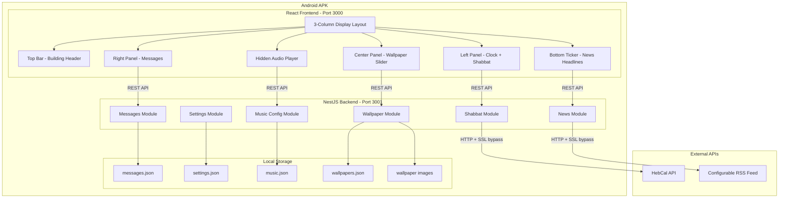
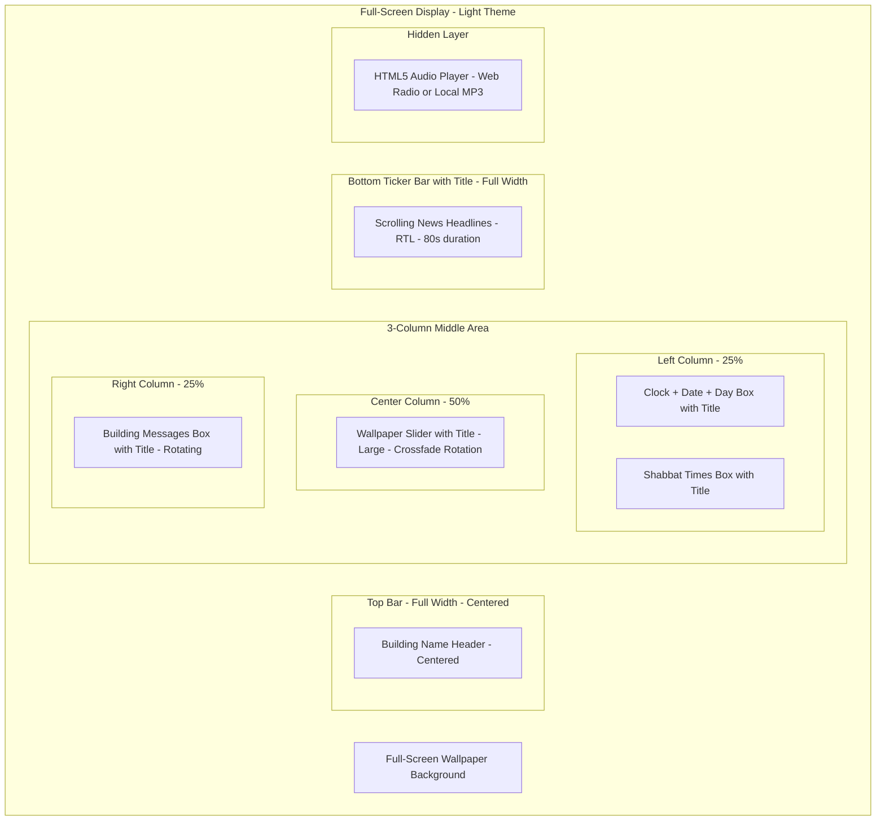
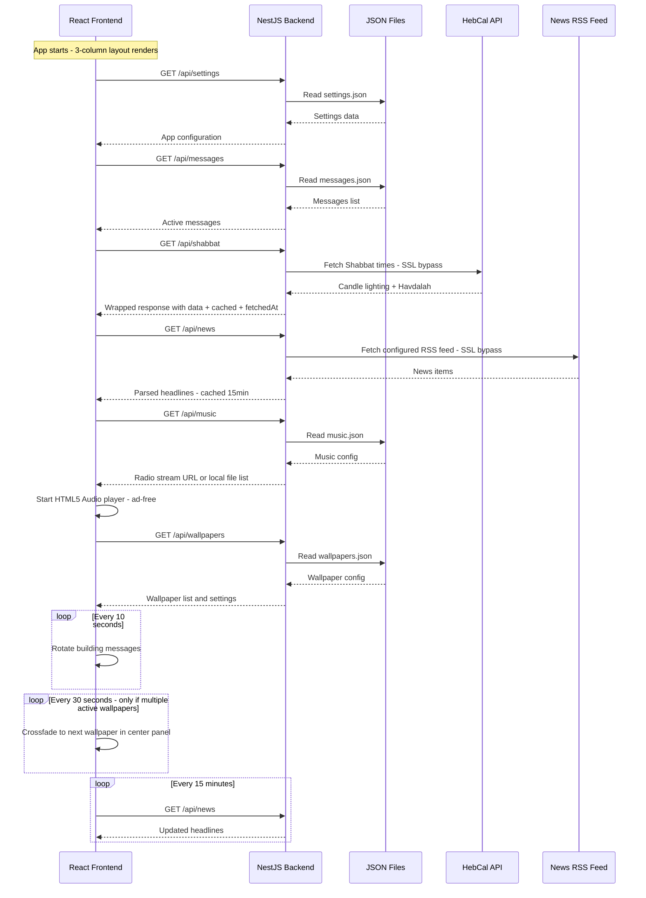
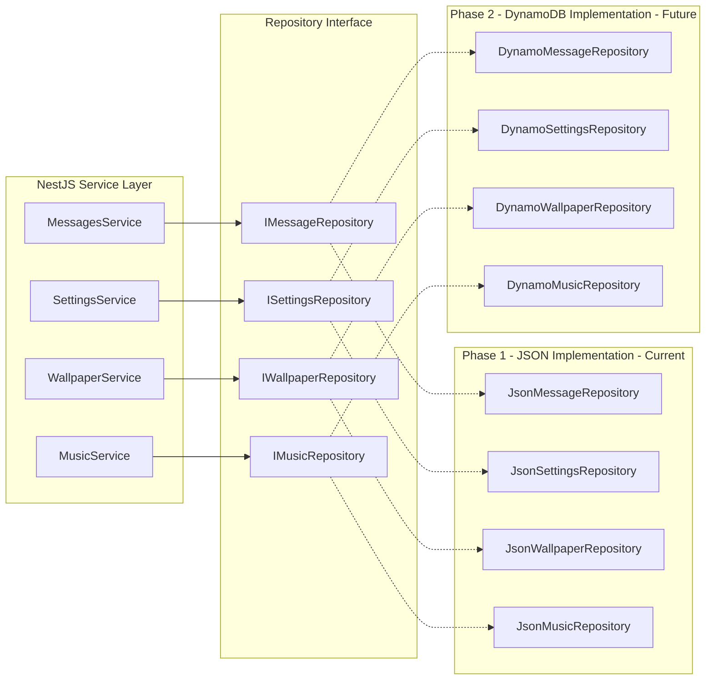

# Home Display - Building Lobby TV Application

## Overview

A full-screen TV display application for a 30-apartment building lobby. The app shows building messages, Shabbat enter/exit times, Israeli news headlines, wallpapers, and plays ad-free background music. Designed for 1080p landscape displays with full RTL/Hebrew support and a light-colored theme.

## Tech Stack

| Layer | Technology |
|-------|-----------|
| Frontend | React 18 + TypeScript + Tailwind CSS + Vite |
| Backend | NestJS + TypeScript |
| Data Storage | JSON files initially → DynamoDB later via Repository Pattern |
| Music | Web Radio Streams + Local MP3 files - AD-FREE, no YouTube |
| Shabbat Times | HebCal REST API |
| News | RSS feed parsing - single configurable source |
| Packaging | Capacitor or Cordova for Android APK |
| Monorepo | npm workspaces |

## Architecture Diagram



## Dashboard Layout - 3-Column Design

The display uses a **3-column layout** with a **full-screen wallpaper background**, **light-colored semi-transparent overlaid widget boxes**, inspired by the Nuvola lobby display system. Every widget panel has a **title header**. The design uses **light colors** with strong contrast for TV readability.

```
┌─────────────────────────────────────────────────────────────────────┐
│                                                                     │
│                    ┌────────────────────┐                           │
│                    │  🏠 מגדלי הים      │                           │
│                    │  Building Header   │                           │
│                    └────────────────────┘                           │
│                                                                     │
│  ┌──────────────┐  ┌────────────────────┐  ┌────────────────────┐  │
│  │ 🕐 שעון      │  │                    │  │ 📋 הודעות הבניין   │  │
│  │   14:30      │  │  🖼️ תמונה          │  │  • תיקון מעלית     │  │
│  │  יום רביעי   │  │                    │  │  • אסיפת דיירים    │  │
│  │  11 במרץ     │  │  Wallpaper         │  │  • ניקיון חצר      │  │
│  │  י״א אדר    │  │  Slider            │  │                    │  │
│  └──────────────┘  │  (Center Panel)    │  │                    │  │
│                    │                    │  │                    │  │
│  ┌──────────────┐  │                    │  │                    │  │
│  │ 🕯️ זמני שבת  │  │                    │  │                    │  │
│  │ כניסה: 17:15 │  │                    │  │                    │  │
│  │ יציאה: 18:20 │  │                    │  │                    │  │
│  │ פרשת ויקרא  │  └────────────────────┘  └────────────────────┘  │
│  └──────────────┘                                                   │
│                                                                     │
│ ┌─────────────────────────────────────────────────────────────────┐ │
│ │ 📰 חדשות ◄ כותרת חדשות ראשונה | כותרת שנייה | כותרת שלישית    │ │
│ └─────────────────────────────────────────────────────────────────┘ │
└─────────────────────────────────────────────────────────────────────┘
           🎵 Hidden Music Player - Background Audio
```



### Layout Details - 3-Column with RTL

| Layer | Position | Content | Style | Behavior |
|-------|----------|---------|-------|----------|
| Background | Full screen | Wallpaper image from JSON config | Full bleed, cover | Static background via WallpaperLayer |
| Building Name | Top, centered, full width | Building name | Light panel with title header | Static |
| Clock and Date Box | Left column, top | Time, day, date, Hebrew date - large font | Light panel with title header | Real-time update every second |
| Shabbat Times Box | Left column, below clock | Candle lighting, havdalah, parasha | Light panel with title header | Updates weekly via HebCal, graceful unavailable state |
| Wallpaper Slider | Center column | Large wallpaper display with crossfade rotation | WidgetBox with !p-0 content, pagination dots | Crossfade every 30s if multiple wallpapers active |
| Messages Box | Right column | Rotating building messages | Light panel with title header | Messages rotate every 10s |
| News Ticker | Bottom, full width | Scrolling headlines from configured RSS source | Light bar with title | Continuous RTL scroll, 80s duration |
| Music Player | Hidden | HTML5 Audio element with floating indicator | display: hidden, pulse indicator when playing | Continuous audio playback, ad-free |

### Visual Design Tokens - LIGHT THEME

```
Colors - Light Theme with High Contrast:
  - Panel Background: rgba(255, 255, 255, 0.85)    -- white, 85% opacity
  - Panel Border: rgba(0, 0, 0, 0.08)               -- subtle shadow border
  - Panel Shadow: 0 4px 20px rgba(0, 0, 0, 0.15)    -- soft drop shadow
  - Title Background: #2563EB                         -- blue header for box titles
  - Title Text: #FFFFFF                                -- white text on title bar
  - Primary Text: #1F2937                              -- dark gray, high contrast
  - Secondary Text: #4B5563                            -- medium gray
  - Accent: #2563EB                                    -- blue for highlights
  - Urgent Background: #FEE2E2                         -- light red bg
  - Urgent Text: #DC2626                               -- red text
  - Urgent Border: #DC2626                              -- red border
  - Shabbat Accent: #D97706                             -- warm amber for candle icon
  - News Bar Background: rgba(255, 255, 255, 0.90)    -- near-opaque white
  - Clock Time Color: #111827                           -- near-black for large time

Contrast Requirements - WCAG AA minimum:
  - Primary text on panel: 12.6:1 ratio - PASS
  - Title text on blue header: 8.6:1 ratio - PASS
  - All text must meet minimum 4.5:1 contrast ratio

Typography:
  - Building Name: 36px, bold, #1F2937
  - Clock Time: 64px, bold, #111827              -- LARGE for TV readability
  - Day of Week: 28px, medium, #1F2937
  - Gregorian Date: 24px, regular, #4B5563
  - Hebrew Date: 24px, regular, #4B5563
  - Widget Title Bar: 18px, bold, #FFFFFF on blue
  - Widget Content: 20px, regular, #1F2937
  - News Ticker: 24px, medium, #1F2937
  - Messages: 22px, regular, #1F2937

Font Family:
  - Hebrew: 'Heebo' from Google Fonts - clean, modern, excellent TV readability
  - English fallback: system-ui, sans-serif
```

### Widget Box Design

Every widget panel follows this structure using the `WidgetBox` common component:

```
┌─────────────────────────┐
│ 🔷 Title Bar - Blue BG  │  ← 36px height, white text, icon + title
├─────────────────────────┤
│                         │
│   Content Area          │  ← White/light bg, dark text, padding 16px
│   High contrast text    │
│                         │
└─────────────────────────┘
   ↑ rounded corners (12px), soft shadow
```

## Project Structure

```
home-display/
├── package.json                 # Workspace root
├── packages/
│   ├── frontend/                # React application
│   │   ├── package.json
│   │   ├── tsconfig.json
│   │   ├── tsconfig.node.json
│   │   ├── tailwind.config.js
│   │   ├── postcss.config.js
│   │   ├── vite.config.ts
│   │   ├── index.html
│   │   └── src/
│   │       ├── main.tsx
│   │       ├── App.tsx
│   │       ├── index.css         # Tailwind directives + scroll-rtl animation
│   │       ├── vite-env.d.ts
│   │       ├── assets/
│   │       │   └── .gitkeep
│   │       ├── components/
│   │       │   ├── layout/
│   │       │   │   ├── DisplayScreen.tsx     # Main container with 3-column grid
│   │       │   │   ├── WallpaperLayer.tsx    # Full-screen background layer
│   │       │   │   ├── TopBar.tsx            # Building header - centered full width
│   │       │   │   ├── LeftPanel.tsx         # Left column: Clock + Shabbat
│   │       │   │   ├── CenterPanel.tsx       # Center column: Wallpaper slider
│   │       │   │   ├── RightPanel.tsx        # Right column: Messages
│   │       │   │   ├── BottomTicker.tsx      # News scrolling bar
│   │       │   │   └── SidePanel.tsx         # Legacy - not currently used
│   │       │   ├── widgets/
│   │       │   │   ├── BuildingHeader.tsx    # Building name and logo
│   │       │   │   ├── ClockWidget.tsx       # Time + Hebrew date via @hebcal/core
│   │       │   │   ├── ShabbatWidget.tsx     # Candle lighting times with graceful errors
│   │       │   │   ├── MessagesWidget.tsx    # Rotating building messages
│   │       │   │   ├── NewsTicker.tsx        # Scrolling news headlines - 80s RTL
│   │       │   │   ├── WallpaperWidget.tsx   # Wallpaper display - small/large modes
│   │       │   │   └── MusicPlayer.tsx       # Hidden HTML5 audio player
│   │       │   └── common/
│   │       │       ├── WidgetBox.tsx          # Reusable widget container with title
│   │       │       ├── GlassPanel.tsx         # Semi-transparent panel
│   │       │       ├── FadeTransition.tsx     # Crossfade animation wrapper
│   │       │       └── LoadingSpinner.tsx
│   │       ├── hooks/
│   │       │   └── useApi.ts                 # React Query hooks for all API endpoints
│   │       ├── services/
│   │       │   ├── api.ts                    # Axios API client configuration
│   │       │   └── types.ts                  # TypeScript type definitions
│   │       └── i18n/
│   │           ├── index.ts                  # i18next configuration
│   │           ├── he.json                   # Hebrew translations
│   │           └── en.json                   # English translations
│   │
│   └── backend/                 # NestJS application
│       ├── package.json
│       ├── tsconfig.json
│       ├── nest-cli.json
│       ├── src/
│       │   ├── main.ts                       # Port 3001, /api prefix, CORS
│       │   ├── app.module.ts                 # Root module importing all features
│       │   ├── messages/
│       │   │   ├── messages.module.ts
│       │   │   ├── messages.controller.ts
│       │   │   ├── messages.service.ts
│       │   │   └── dto/
│       │   │       └── message.dto.ts
│       │   ├── shabbat/
│       │   │   ├── shabbat.module.ts
│       │   │   ├── shabbat.controller.ts     # Wraps response in ShabbatResponseDto
│       │   │   ├── shabbat.service.ts        # HebCal API with SSL bypass + 24h cache
│       │   │   └── dto/
│       │   │       └── shabbat.dto.ts
│       │   ├── news/
│       │   │   ├── news.module.ts
│       │   │   ├── news.controller.ts
│       │   │   ├── news.service.ts           # RSS parsing with SSL bypass + 15min cache
│       │   │   └── dto/
│       │   │       └── news.dto.ts
│       │   ├── wallpapers/
│       │   │   ├── wallpapers.module.ts
│       │   │   ├── wallpapers.controller.ts  # Serves config + static image files
│       │   │   ├── wallpapers.service.ts
│       │   │   └── dto/
│       │   │       └── wallpaper.dto.ts
│       │   ├── music/
│       │   │   ├── music.module.ts
│       │   │   ├── music.controller.ts
│       │   │   ├── music.service.ts
│       │   │   └── dto/
│       │   │       └── music.dto.ts
│       │   ├── settings/
│       │   │   ├── settings.module.ts
│       │   │   ├── settings.controller.ts
│       │   │   ├── settings.service.ts
│       │   │   └── dto/
│       │   │       └── settings.dto.ts
│       │   └── common/
│       │       ├── interfaces/
│       │       │   ├── repository.interface.ts          # Generic IRepository<T>
│       │       │   ├── message-repository.interface.ts
│       │       │   ├── settings-repository.interface.ts
│       │       │   ├── wallpaper-repository.interface.ts
│       │       │   └── music-repository.interface.ts
│       │       ├── repositories/
│       │       │   ├── json-message.repository.ts
│       │       │   ├── json-settings.repository.ts
│       │       │   ├── json-wallpaper.repository.ts
│       │       │   └── json-music.repository.ts
│       │       └── filters/
│       │           └── http-exception.filter.ts
│       └── data/
│           ├── messages.json
│           ├── settings.json
│           ├── music.json
│           ├── wallpapers.json
│           └── wallpapers/
│               ├── .gitkeep
│               └── default.jpg
│
└── plans/
    └── architecture.md
```

## Backend API Design

### Messages API

| Method | Endpoint | Description |
|--------|----------|-------------|
| GET | /api/messages | Get all active messages |
| GET | /api/messages/:id | Get single message |
| POST | /api/messages | Create new message |
| PUT | /api/messages/:id | Update message |
| DELETE | /api/messages/:id | Delete message |

#### Message Schema

```json
{
  "id": "uuid",
  "title": "הודעה חשובה",
  "content": "תוכן ההודעה כאן",
  "type": "info | warning | urgent | event",
  "priority": 1,
  "active": true,
  "startDate": "2026-03-11T00:00:00Z",
  "endDate": "2026-03-18T00:00:00Z",
  "createdAt": "2026-03-11T00:00:00Z"
}
```

### Shabbat Times API

| Method | Endpoint | Description |
|--------|----------|-------------|
| GET | /api/shabbat | Get this weeks Shabbat times |
| GET | /api/shabbat/upcoming | Get next 4 weeks |

#### HebCal Integration

- Endpoint: `https://www.hebcal.com/shabbat?cfg=json&geonameid=293397&M=on`
- GeonameID 293397 = Tel Aviv
- Cached for 24 hours to minimize API calls
- SSL bypass via `httpsAgent: new https.Agent({ rejectUnauthorized: false })`
- Returns candle lighting time and havdalah time
- Response wrapped in `{ data, cached, fetchedAt }` DTO

### News API

| Method | Endpoint | Description |
|--------|----------|-------------|
| GET | /api/news | Get latest news headlines from configured source |

#### News Source Configuration

Only **one news source is active at a time**, configured via settings. Available sources:

| Source Key | Name | RSS URL | Category |
|-----------|------|---------|----------|
| ynet | Ynet | https://www.ynet.co.il/Integration/StoryRss2.xml | General news |
| walla-news | Walla News | https://rss.walla.co.il/feed/1 | Breaking news |
| walla-headlines | Walla Headlines | https://rss.walla.co.il/feed/22 | Top headlines |
| maariv | Maariv | https://www.maariv.co.il/Rss/RssFeedsMivzak662 | Breaking news |

- **Default source:** `ynet`
- Active source is configured in `settings.json` under `news.activeSource`
- Parsed using `rss-parser` npm package with SSL bypass
- Cached for 15 minutes
- Returns top 20 headlines

### Wallpaper API

| Method | Endpoint | Description |
|--------|----------|-------------|
| GET | /api/wallpapers | Get wallpaper configuration from JSON |
| GET | /api/wallpapers/images/:filename | Serve wallpaper image file |

#### Wallpaper Config Schema - wallpapers.json

```json
{
  "wallpapers": [
    {
      "id": "1",
      "filename": "default.jpg",
      "title": "ברירת מחדל",
      "active": true
    }
  ],
  "rotationEnabled": true,
  "rotationInterval": 30000
}
```

> **Note:** If only one wallpaper is configured or active, rotation is automatically disabled. Wallpaper image files are stored locally in `data/wallpapers/` directory. The `WallpaperWidget` component supports both a small preview mode and a large center-panel mode with crossfade transitions and pagination dots.

### Music Configuration API - AD-FREE

| Method | Endpoint | Description |
|--------|----------|-------------|
| GET | /api/music | Get music configuration |
| GET | /api/music/stream/:filename | Stream local audio file |
| PUT | /api/music | Update music configuration |

#### Music Strategy - No Ads

The app uses the **HTML5 Audio API** for ad-free playback. It supports **three ad-free music sources**:

| Source | How it Works | Pros | Cons |
|--------|-------------|------|------|
| **Local MP3 files** | Audio files stored in `data/music/` folder, served by backend | Zero ads, works offline, full control | Need to manage files manually |
| **Web Radio Streams** | Direct HTTP audio streams from Israeli radio stations | Free, legal, no ads in stream | Requires internet, limited control |
| **Custom Stream URL** | Any direct audio stream URL | Flexible | Depends on source availability |

**Available Israeli Web Radio Streams - Free, No Ads:**

| Station | Stream URL | Genre |
|---------|-----------|-------|
| Galgalatz | https://glzwizzlv.bynetcdn.com/glglz_mp3 | Israeli pop/hits |
| 88FM | https://icecast.88fm.co.il/88fm.mp3 | Alternative/indie |
| Eco99FM | https://eco01.mediacast.co.il/ecolive/99fm_aac | Easy listening |
| Reshet Gimmel | https://radiocast-rng.mediacast.co.il/radio_main.mp3 | Israeli classic |
| Kan Kol Hamusica | https://kankm.mediacast.co.il/kankm_aac | Classical |

#### Music Config Schema - music.json

```json
{
  "enabled": true,
  "volume": 30,
  "source": "radio",
  "localPlaylist": [
    {
      "id": "1",
      "filename": "background-music-1.mp3",
      "title": "מוזיקת רקע",
      "artist": "אמן"
    }
  ],
  "radioStation": {
    "name": "Galgalatz",
    "url": "https://glzwizzlv.bynetcdn.com/glglz_mp3"
  },
  "customStreamUrl": null,
  "currentIndex": 0,
  "shuffle": false,
  "autoplay": true
}
```

> **`source` field options:** `"local"` for MP3 files, `"radio"` for web radio stream, `"custom"` for custom URL.

### Settings API

| Method | Endpoint | Description |
|--------|----------|-------------|
| GET | /api/settings | Get app settings |
| PUT | /api/settings | Update app settings |

#### Settings Schema

```json
{
  "buildingName": "מגדלי הים",
  "buildingAddress": "רחוב הים 1, תל אביב",
  "language": "he",
  "location": {
    "geonameid": 293397,
    "city": "תל אביב"
  },
  "news": {
    "activeSource": "ynet",
    "refreshInterval": 900000
  },
  "display": {
    "messageRotationInterval": 10000,
    "wallpaperRotationInterval": 30000,
    "shabbatCacheInterval": 86400000
  },
  "theme": {
    "primaryColor": "#2563EB",
    "accentColor": "#D97706",
    "panelBackground": "rgba(255, 255, 255, 0.85)",
    "textColor": "#1F2937"
  }
}
```

> **Note:** `news.activeSource` must match one of the source keys from the available sources table above.

## Data Flow Diagram



## Cordova/Capacitor Packaging Strategy

Since the app needs to run as an Android APK with a local backend:

### Option A: Capacitor + Background Service - Recommended

1. Use **Capacitor** instead of Cordova for better modern support
2. Build the React frontend as static assets
3. Use a **Capacitor plugin** to start a lightweight HTTP server on the device
4. The NestJS backend gets bundled and runs via a Node.js runtime on Android
5. Alternatively, use **pako** or a similar approach to embed a simple Express/Fastify server

### Option B: All-in-One Frontend

1. Move all logic to the frontend
2. Call external APIs directly from React - HebCal, RSS via CORS proxy
3. Store data in localStorage/IndexedDB instead of JSON files
4. Simpler packaging but less flexible

### Recommended Approach

Start with **development mode** where both frontend and backend run on a local machine or Raspberry Pi connected to the TV. The Cordova/Capacitor packaging can be addressed later once the core app is stable. For Android packaging, we can explore:

- **NodeJS on Android** via `nodejs-mobile-cordova` plugin
- **Capacitor** with a bundled server
- Alternatively, run on a **Raspberry Pi** or **mini PC** connected to the TV via HDMI

## Repository Pattern - JSON to DynamoDB Migration Path

All data access goes through a **Repository interface**. Initially implemented with JSON file storage, later swapped to DynamoDB without changing any service logic.



### Repository Interface

```typescript
// Generic IRepository<T> - repository.interface.ts
export interface IRepository<T> {
  findAll(): Promise<T[]>;
  findById(id: string): Promise<T | null>;
  create(item: Partial<T>): Promise<T>;
  update(id: string, item: Partial<T>): Promise<T>;
  delete(id: string): Promise<void>;
}

// Specialized interfaces per domain:
// - IMessageRepository extends domain-specific methods
// - ISettingsRepository for singleton settings
// - IWallpaperRepository for wallpaper config
// - IMusicRepository for music config

// Phase 1: Json*Repository implements I*Repository (JSON files)
// Phase 2: Dynamo*Repository implements I*Repository (DynamoDB)
// Swap via NestJS dependency injection - zero service changes
```

## Key Technical Decisions

| Decision | Choice | Rationale |
|----------|--------|-----------|
| Build tool | Vite | Fast HMR, great TypeScript support |
| State management | React Query - TanStack Query | Perfect for API data fetching and caching |
| RTL support | CSS dir attribute + logical properties | Native RTL without extra plugins |
| i18n | i18next + react-i18next | Industry standard, supports Hebrew |
| Music player | HTML5 Audio API | Native browser audio, supports MP3 and radio streams, ad-free |
| RSS parsing | rss-parser on backend | Avoids CORS issues with RSS feeds |
| HTTP client | axios | Both frontend and backend |
| Date/Hebrew date | @hebcal/core library | Hebrew calendar support |
| Data access | Repository Pattern | Clean swap from JSON files to DynamoDB |
| Monorepo | npm workspaces | Simple, built-in to npm |
| Theme | Light colors with high contrast | TV readability, WCAG AA compliance |
| SSL handling | rejectUnauthorized: false | Corporate proxy/SSL compatibility for HebCal and RSS |
| Layout | 3-column flexbox | Left widgets, center wallpaper, right widgets |
| Error handling | Error boundaries per widget + graceful states | Individual widget failures don't crash the whole display |

## Phase Plan

### Phase 1: Core Display - COMPLETED ✅
- Project scaffolding and monorepo setup
- Backend with all API modules, repository pattern, and JSON storage
- Frontend 3-column display with all widgets - Nuvola style, light theme
- All widget boxes with title headers via WidgetBox component
- RTL and Hebrew support with i18n
- Ad-free background music via HTML5 Audio - web radio and local MP3
- Wallpaper slider in center panel with crossfade rotation
- High contrast light-colored design
- Error boundaries with graceful degradation
- SSL bypass for HebCal and RSS APIs
- News ticker with 80s RTL scroll animation
- Pushed to GitHub: https://github.com/arnoldsimha/building-lobby-tv.git

### Phase 2: Polish and Features
- Admin panel for message management
- DynamoDB migration via repository swap
- More news sources
- Weather widget - optional
- Smooth animations and transitions

### Phase 3: Packaging
- Cordova/Capacitor Android APK build
- Auto-start on boot
- Kiosk mode - prevent exiting the app
- OTA updates for content
